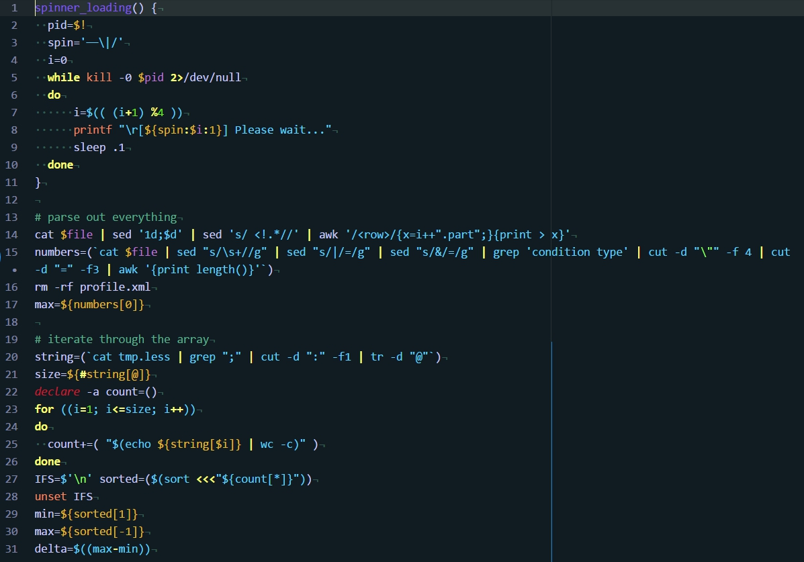

# Inter Dimensional Syntax Theme for Atom

A syntax theme for [Atom](https://atom.io/) with colors from Rick and Morty on a dark barkground. The code is mostly based on the [Dracula](https://atom.io/themes/dracula-syntax) for Atom syntax theme. The colors have been curated from the animated TV show Rick and Morty with [inspiration from the following screenshots](inspiration/).

## Languages
Because the code base is [Dracula](https://atom.io/themes/dracula-syntax), which is possibly the best coded themes that I have found so far, many languages work great. The following languages have been tested and optimized for experience, click of the language for a screenshot of the syntax in action:
* [css](screenshots/css.jpg)
* [go](screenshots/go.jpg)
* [js](screenshots/js.jpg)
* [json](screenshots/json.jpg)
* [md](screenshots/md.jpg)
* [php](screenshots/php.jpg)
* [py](screenshots/py.jpg)
* [rb](screenshots/rb.jpg)
* [sass](screenshots/sass.jpg)
* [bash](screenshots/bash.jpg)
* [sql](screenshots/sql.jpg)
* [xml](screenshots/xml.jpg)
* [yml](screenshots/yml.jpg)

## To Do
* Still testing colors and accepting suggestions
  * If you have one, please change the colors first and provide a screenshot of the adjustment [here](https://github.com/tommybonobo/inter-dimensional-syntax/issues).
