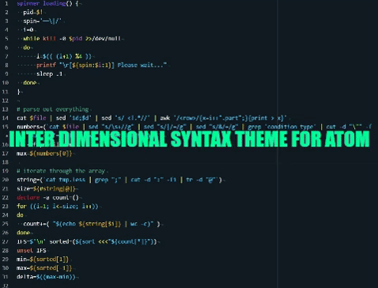

# Inter Dimensional Syntax Theme for Atom

<!-- @import "[TOC]" {cmd="toc" depthFrom=2 depthTo=2 orderedList=false} -->
<!-- code_chunk_output -->

* [Languages](#languages)
* [To Do](#to-do)
* [Changelog](#changelog)

<!-- /code_chunk_output -->

A syntax theme for [Atom](https://atom.io/) with colors from Rick and Morty on a dark barkground. The code is mostly based on the [Dracula](https://atom.io/themes/dracula-syntax) for Atom syntax theme. The colors have been curated from the animated TV show Rick and Morty with.

## Languages
Because the code base is [Dracula](https://atom.io/themes/dracula-syntax), which is possibly the best coded themes that I have found so far, many languages work great. The following languages have been tested and optimized for experience, click of the language for a screenshot of the syntax in action:
* [css](screenshots/css.jpg)
* [go](screenshots/go.jpg)
* [js](screenshots/js.jpg)
* [json](screenshots/json.jpg)
* [md](screenshots/md.jpg)
* [php](screenshots/php.jpg)
* [py](screenshots/py.jpg)
* [rb](screenshots/rb.jpg)
* [sass](screenshots/sass.jpg)
* [bash](screenshots/bash.jpg)
* [sql](screenshots/sql.jpg)
* [xml](screenshots/xml.jpg)
* [yaml](screenshots/yaml.jpg)

## To Do
* Still testing colors and accepting suggestions
  * If you have one, please change the colors first and provide a screenshot of the adjustment [here](https://github.com/tommybonobo/inter-dimensional-syntax/issues).

## Changelog
### Version 2.0.0
* Added .gitignore
### Version 1.6.0
* Correction to readme
### Version 1.5.0
* Correction to apm publish
### Version 1.4.0
* Correction to apm publish
### Version 1.3.0
* Updated screenshots
### Version 1.2.0
* Correction to apm publish
### Version 1.1.0
* Changes to `colors.less`
  * `@foreground` changed to `@rick-lab-coat`
* Changes to `syntax-variables.less`
	* `@syntax-color-renamed` darkened 10%
	* `@syntax-color-added` darkened 30%
	* `@syntax-color-modified` darkened 10%
	* `@syntax-color-removed` darkened 20%
* Changes to `base.less`
  * `atom-text-editor.is-focused .selection .region` lightened by 10%
  * `atom-text-editor.is-focused .line.cursor-line` lightened by 5%
  * `atom-text-editor .gutter .line-number.git-line-added (border-left-width)` changed from 5px to 3px
  * `.syntax--keyword` removed `font-weight: bold;`
  * `atom-text-editor .highlight.find-result .region (background)` lightened by 17%
  * `atom-text-editor .highlight.current-result .region,
  atom-text-editor .highlight.current-result ~ .highlight.selection .region (background)` lightened by 10%
### Version 1.0.0
* Initial publication
